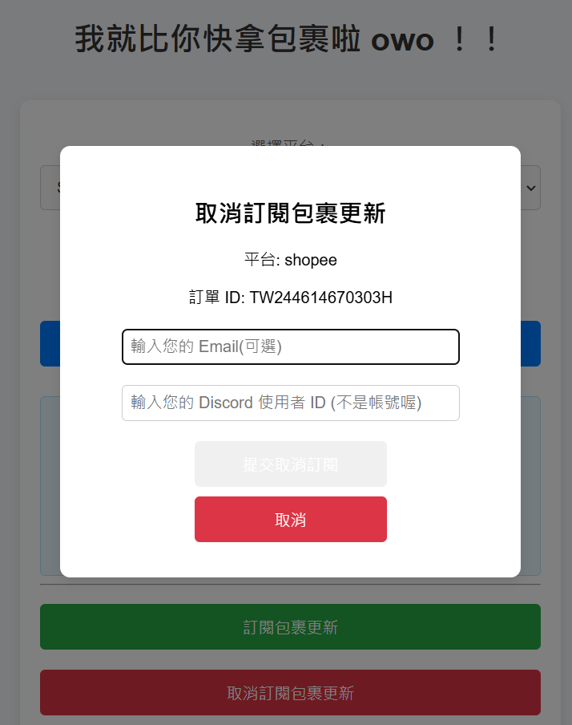

# Parcel Tracker
## Concept Development

<!-- Why does your team want to build this idea/project?  -->

台灣有非常多的物流平台，而蝦皮等電商平台在商品送到後並不會立即通知我們去取貨，有時甚至會延遲半天之久。所以我們設計了一個 Discord Bot，透過 Discord 指令來查詢不同物流的包裹進度，而且還不用輸入那些麻煩的驗證碼。同時我們還設計一個訂單查詢平台，結合到包裹追蹤的 Discord 機器人，讓兩邊都能同步使用服務。

<p align="center"></p>

- 查詢不同物流公司的包裹進度，例如 7-11、全家、蝦皮、OK Mart
- 架設一個包裹追蹤的 Discord 機器人和訂單查詢平台

## Implementation Resources

<!-- e.g., How many Raspberry Pi? How much you spent on these resources? -->
- computer 

## Existing Library/Software

<!-- Which libraries do you use while you implement the project -->

### Backend:
- `fastapi`: 負責後端 API 開發，處理邏輯和資料
- `uvicorn`: ASGI 伺服器，用於執行 FastAPI 
- `requests`: 對目標網頁發送 http requests
- `beautifulsoup4`: 解析爬到的 HTML
- `pillow`: 處理 captcha 圖片
- `pytesseract`: OCR 光學影像辨識
- `apscheduler`: 任務排程
    
### Database:
- MySQL: 資料庫
- `mysql.connector`: 建立與 MySQL 資料庫的連線

### Discord 機器人:
- `discord.py`: Discord bot framework
- `threading`: 為了讓 Discord bot 有 Webhook 功能(用來接收 Backend API 所傳送包裹更新的通知)，所以使用 threading 來執行一個 FastAPI 後端監聽在 3000 port。

### Deployment
- Docker: 容器化應用程式
	- docker-compose
- Nginx: Rerverse proxy
- certbot: SSL certificate (https)

## Implementation Process

<!-- What kind of problems you encounter, and how did you resolve the issue? -->

### 重點程式
- `.bot.env`:
    - 機器人環境相關變數
- `.backend.env`:
    - 資料庫環境及 Webhook 相關變數
- `/frontend`:前端服務
    - 提供網頁讓使用者查詢包裹狀態
    - index.html: 網頁的程式
    - nginx.conf: reverse proxy/web server 設定檔
- `/backend` 後端服務
    - 功能: 提供 API 來追蹤各物流平台的包裹資訊
    - `api.py` : API 程式
    - `/parcel_tw` : 支援多個物流平台的包裹追蹤 pakage
- `/bot` 機器人服務
    - 功能: 提供與機器人互動的功能，如:通知包裹狀態
    - `/app` : 機器人相關 module
        - `bot.py`: 負責機器人的主邏輯。
    - `webhook.py`: 用來接收 Backend API 所傳送包裹更新的通知
    - `main.py` : 主程式
- `/db` 資料庫設定
    - 功能: 初始化資料庫，並匯入物流平台的基本資訊
檔案說明:
    - `init.sql`: 用於建立資料庫及其表格
    - `platform_info.sql`: 匯入物流平台的基本資料
 
### 遇到困難

- 大部分的網站都有防止爬蟲機制，每個網站繞過驗證碼的方式也不盡相同，爬蟲花費了不少的時間。
- 因為爬蟲與檢查包裹是否更新的邏輯是在後端中，因此 Discord 機器人沒辦法主動得知包裹狀態是否更新，後來解決方法是使用 Webhook 來讓機器人監聽一個連接埠，藉由接收後端傳送過來的通知來得知包裹更新狀態。
- 在測試前端是否成功發送 request 給後端 API 時，發現無法發送 request，查看錯誤訊息後發現是 CORS(Cross-Origin Resource Sharing) error，原因是因為 Web server 和 backend 的 port 不同且 Container 之間無法直接通訊，後來使用 fastapi.middleware.cors 這個 module 解決[詳見reference]。
- (cont.)後來發現雖然網頁已經可以 fetch 後端的 API(跑在不同 port 上)，但需要程式中寫死 server 的真實 IP 與 port ，或是使用 reverse proxy，前者不利於讓其他使用者自行重建此服務，因此後來使用 nginx 將前端網頁與後端 API 的反向代理到 web server 的 port 上使它們變成同一來源，可以直接通訊。


## Knowledge from Lecture

<!-- What kind of knowledge did you use on this project? -->
- Linux 系統基本指令
- Web development
- SQL
- Web Crawler
- WebServer
- Nginx Reverse Proxy
- Mail Server
- Containerization


## Installation

<!-- How do the user install with your project? -->

- 建立屬於自己的包裹追蹤的 Discord 機器人
    - 詳細 Discord bot 設置可參閱 [How to Make a Discord Bot in the Developer Portal](https://realpython.com/how-to-make-a-discord-bot-python/#how-to-make-a-discord-bot-in-the-developer-portal)
    - 簡易教學:
        - 到 https://discord.com/developers/applications
        - `New Application` -> 取名字
        -  到 Menu -> `OAuth2` -> OAuth2 URL Generator -> `bot` -> Bot Permissions -> `Adminstrator` -> 複製 url -> 貼到 browser 貼上 -> 選伺服器... -> 確認
        - 到 Menu ->`bot` -> Privileged Gateway Intents -> 三個選項都勾 -> save changes
    - 複製 `DISCORD_TOKEN` : Menu -> `bot` -> Token -> `Reset token` -> `COPY`

### Linux
- clone :
```
git clone git@github.com:ryanycs/parcel-tracker.git
cd parcel-tracker
```
- 將剛才取得 `DISCORD_TOKEN` 填入 `.bot.env` 中的`DISCORD_BOT_TOKEN=`
- 啟動 Docker :
```
# 若尚未安裝 Docker 環境，請先
sudo snap install docker
sudo apt install docker-compose

# 建立 Docker Container
docker-compose up

# Open browser and run on localhost/your domain name
http://hocalhost
```
- 所有服務上線，可以看到 Discord bot 也有上線


### Reverse Proxy & SSL Certificate

1. 在 Linux 上安裝 Nginx
2. 把 docker-compose.yml 中 frontend export 的 port 改成 8080
3. 新增以下 config 到 /etc/nginx/sites-enabled/ 底下
```
server {

    listen 80;
    listen [::]:80;

    server_name lsa.ryanycs.com;

    # proxy to frontend server
    location / {

        proxy_pass http://localhost:8080;

        proxy_set_header Host $host;
        proxy_set_header X-Real-IP $remote_addr;
        proxy_set_header X-Forwarded-For $proxy_add_x_forwarded_for;
        proxy_set_header X-Forwarded-Proto $scheme;
    }
}
```
3. 先確認主機是否有 Public IP 以及 DNS 管理平台是否設定好 DNS record
3. 安裝 [certbot](https://certbot.eff.org/)
4. `sudo certbot`，之後照著程式指引操作即可


## Usage

<!-- How to use your project -->
- Container 建立完成後，即可使用 包裹追蹤 Discord 機器人、訂單查詢平台
- **物流平台** 查詢僅允許以下輸入值:

| SEVEN_ELEVEN  |  FAMILY_MART   |  OK_MART   | SHOPEE |
| -------- | -------- | -------- |-------- |
| 小七 | 全家 | ok | 蝦皮 |
| 7-11 | family | okmart | shopee 
| seven| family-mart | ok-mart
| seven-eleven| family_mart | ok_mart
| seven_eleven| fami
| 711

- Discord bot
	- `/track [物流平台] [訂單編號]`: 查詢包裹進度
        <p align="center"></p>  
        <p align="center"></p>  

	- `/subscribe [物流平台] [訂單編號]`: 訂閱包裹進度，如果包裹狀態有更新會傳送訊息通知使用者 
        <p align="center"></p> 

	- `/unsubscribe [物流平台] [訂單編號]`: 取消訂閱過已經訂閱的包裹進度


- 訂單查詢平台:
    <p align="center"></p>


    - 查詢包裹： 使用者選擇物流平台並輸入訂單 ID，然後點擊「查詢包裹」按鈕。若查詢成功，包裹狀態和時間將顯示在頁面上。
        <p align="center"></p> 


    - 訂閱包裹更新：在查詢包裹後，使用者可以選擇訂閱包裹更新通知。點擊「訂閱包裹更新」按鈕，填寫電子郵件和 Discord 帳號後，點擊「提交訂閱」以完成訂閱。
        - POST : `/api/subscriptions`
         <p align="center">
            </p>

        - 若已訂閱會顯示錯誤

        <p align="center"></p> 


    - 取消訂閱包裹更新：若使用者希望停止接收包裹更新，可以選擇取消訂閱。點擊「取消訂閱包裹更新」按鈕，填寫電子郵件和 Discord 帳號後，點擊「提交取消訂閱」。
        - DELETE : `/api/subscriptions`
         <p align="center">
            </p> 


        - 如果查完資料庫找不到discord id，發現還未訂閱會顯示錯誤訊息
         <p align="center"></p> 


## Future work
- 新增 mail 功能 (目前後端還沒有寄送 mail 的 feature)
- 定期刪除資料庫中已過期的包裹紀錄

## 影片
- [架構說明](https://www.youtube.com/watch?v=xfBNhRqVMAI)
- [Demo](https://www.youtube.com/watch?v=jFkgU9TW5Ak)

## Job Assignment

|       | 姓名     | 負責內容 | 
| ----- | --------| -------- | 
| 組長   | 蘇翊荃   | Discord 機器人，網頁後端(爬蟲、資料庫)、程式部署(Docker、Nginx Reverse Proxy、http certificate)、程式整合 |
| 組員  | 陳品妤   |  網頁前端設計、前端整合 API、架 web server (含 Nginx Reverse Proxy) 在 Container 上 |
| 組員  | 陳嘉璐   |  SQL Server、API、架 mail server、做會議記錄、寫 Readme | 
| 組員  | 楊昱淞   |  網頁前端設計、整合 API |
| 組員  | 余政葳   |  報告  | 

## References
- [Postman Learning Center](https://learning.postman.com/docs/getting-started/overview/)
- [FastAPI](https://fastapi.tiangolo.com/)
- [CORS (Cross-Origin Resource Sharing) - FastAPI](https://fastapi.tiangolo.com/tutorial/cors/#use-corsmiddleware)
- [Get Docker](https://docs.docker.com/get-started/get-docker/)
- [Docker | 建立 PostgreSQL 的 container 時，同時完成資料庫的初始化](https://eandev.com/post/container/docker-postgresql-initialization-scripts/)
